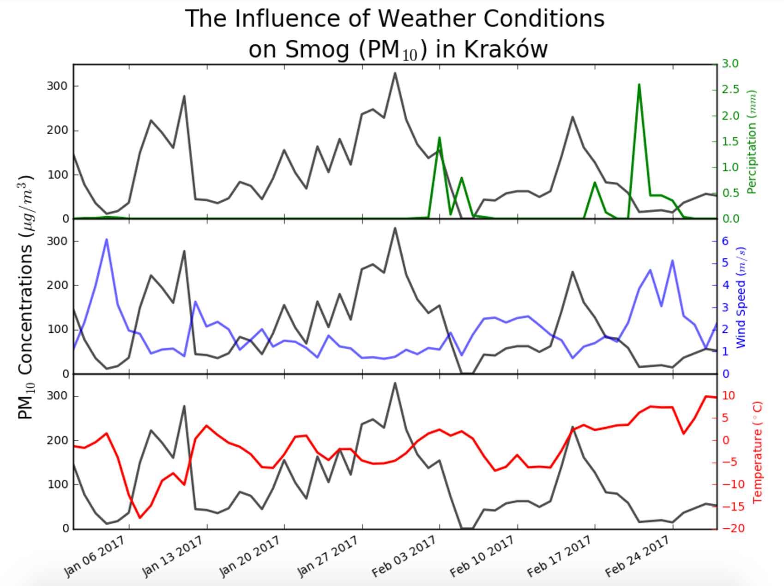

# Smog analysis
A visualization of the effects of weather on the smog levels in Kraków.

## Data
The weather data was downloaded from [Serwis Meteo](http://meteo.ftj.agh.edu.pl/meteo/). Smog data was downloaded from [WIOŚ Kraków](http://monitoring.krakow.pios.gov.pl/archiwalne-dane-pomiarowe/manualne).

## Results

  

The above graph shows clear correlation between **wind speed** and **smog levels**. When the **wind speeds** are high, the **smog levels** drop. 

To a lesser degree we see that **percipitation** is also correlated to **smog levels**. The effect is most prevalent when the **percipitation** is high and the **temperature** is above freezing. So this means that rain (not snow) has an impact on **smog levels**.

Finally, it seems that **temperature** has the smallest effect on the **smog levels**. We see that there are times when **smog levels** are quite high even though the **temperature** is not that low.